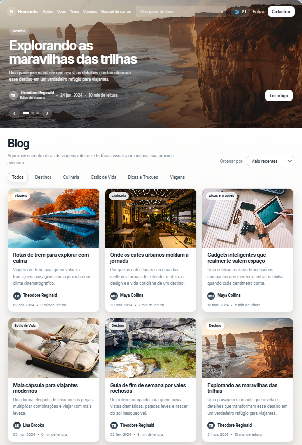

# Horizonte Blog

Aplicação de blog desenvolvida com **Angular**, inspirada em um layout moderno de portal de viagens, com foco em **organização de projeto**, **componentização**, **boas práticas de arquitetura** e **experiência visual refinada**.

> O projeto foi estruturado para servir como uma base sólida, demonstrando uma organização profissional utilizando os próprios recursos do ecossistema Angular, como **Standalone Components**, **lazy loading**, **roteamento**, **separação por camadas** e **componentes inteligentes e de apresentação**.


## Preview



## Objetivo do projeto

Este projeto foi criado para demonstrar, de forma prática, como estruturar uma aplicação Angular moderna utilizando os próprios recursos do framework para separar responsabilidades, facilitar manutenção e preparar a base para futuras integrações com APIs, CMS ou back-end real.

Além da interface inspirada em um blog editorial, a aplicação também serve como referência de organização para projetos pessoais, acadêmicos e de portfólio.

## Funcionalidades

- Destaque principal com artigo em evidência
- Barra de navegação superior com campo de busca
- Filtro por categorias
- Ordenação de posts
- Listagem de artigos em cards
- Página de detalhe do artigo
- Exibição de autor, data e tempo estimado de leitura
- Estado vazio quando nenhum resultado é encontrado
- Estrutura preparada para escalabilidade

## Tecnologias utilizadas

- **Angular 21**
- **TypeScript**
- **Angular Router**
- **Signals** para gerenciamento de estado local
- **Standalone Components**
- **CSS puro** para estilização
- **Assets locais** para imagens e identidade visual

## Arquitetura do projeto

O projeto foi organizado com foco em separação de responsabilidades e clareza estrutural.

```text
src/
├─ app/
│  ├─ core/
│  │  ├─ data/
│  │  ├─ layout/
│  │  ├─ models/
│  │  └─ services/
│  ├─ features/
│  │  └─ blog/
│  │     └─ pages/
│  ├─ shared/
│  │  └─ ui/
│  ├─ app.component.ts
│  ├─ app.config.ts
│  └─ app.routes.ts
├─ assets/
├─ index.html
├─ main.ts
└─ styles.css
```

### `core`
Camada central da aplicação.

Responsável por concentrar elementos que representam a base do sistema:
- modelos de domínio
- dados mockados
- serviço de estado
- shell/layout principal

### `features`
Camada onde ficam as funcionalidades de negócio.

Neste projeto, a feature principal é o blog, com páginas como:
- página inicial
- página de detalhe do post

Esses componentes atuam como **componentes inteligentes**, coordenando estado, rota e composição da interface.

### `shared`
Camada de componentes reutilizáveis de interface.

Contém elementos visuais compartilhados, como:
- navegação
- hero principal
- filtros
- cards de post
- seletor de ordenação
- estado vazio
- identificação do autor

## Decisões de arquitetura

### Componentes inteligentes
Responsáveis por:
- consumir dados e estado
- reagir à navegação
- aplicar regras da tela
- compor a experiência final

### Componentes de apresentação
Responsáveis por:
- renderização da interface
- reuso visual
- comunicação via `input()` e `output()`
- desacoplamento entre layout e regra de negócio

Essa abordagem melhora a manutenção do projeto e facilita sua evolução ao longo do tempo.

## Organização do estado

A aplicação utiliza um serviço de estado local para controlar os dados do blog, filtros, ordenação e seleção de conteúdo. Essa estratégia foi adotada para manter o projeto simples, moderno e alinhado com aplicações front-end que ainda não dependem de uma API externa.

Essa base pode ser expandida futuramente para:
- consumo de API REST
- integração com CMS headless
- persistência de filtros na URL
- cache local
- gerenciamento de estado global, se necessário

## Possíveis evoluções

Este projeto foi estruturado para permitir crescimento sem necessidade de refatoração completa. Algumas melhorias planejáveis:

- integração com API real
- painel administrativo
- autenticação de usuários
- comentários em posts
- paginação
- tema escuro
- internacionalização completa
- testes unitários e de componentes
- deploy automatizado

## Boas práticas aplicadas

- separação por camadas
- foco em reutilização de componentes
- nomes semânticos para arquivos e pastas
- organização por domínio
- arquitetura pronta para escalar
- interface com preocupação estética e responsiva
- base ideal para portfólio técnico


## Autor

Desenvolvido por **Fábio Vinicius Alves dos Santos**.

## Licença

Este projeto está disponível para fins de estudo, portfólio e evolução pessoal.


## Observação final

Este repositório foi pensado não apenas para funcionar, mas também para demonstrar organização, clareza arquitetural e capacidade de evolução técnica.
